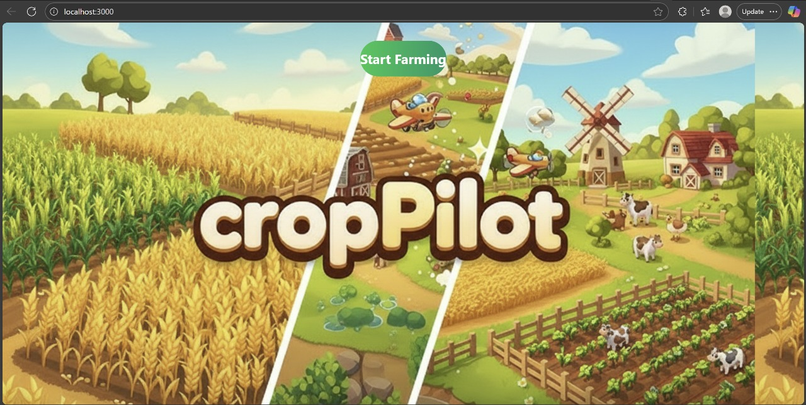
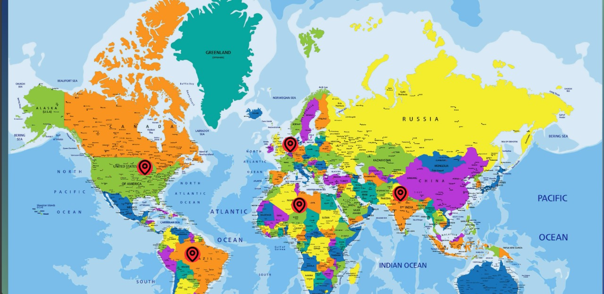
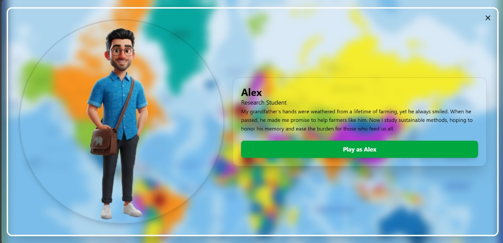
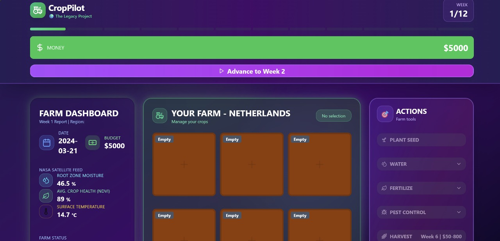
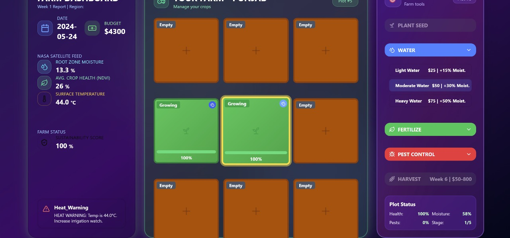
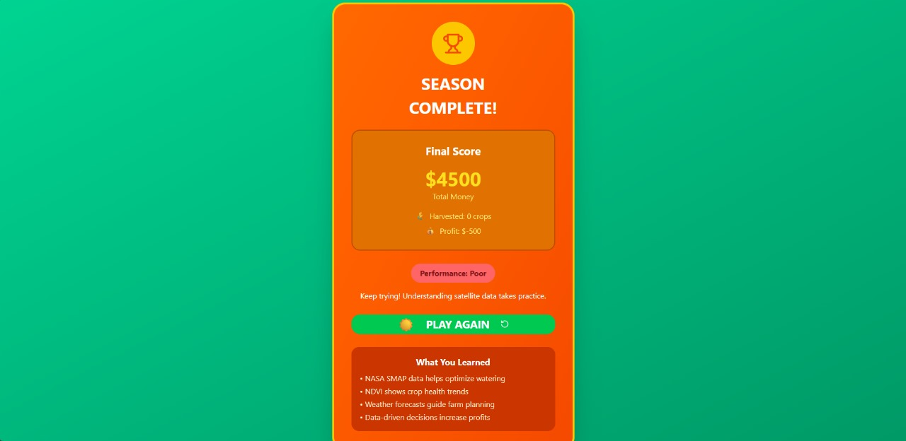

# CropPilot: Global Farm Navigator

## Project Overview
CropPilot: Global Farm Navigator is a full-stack educational farming simulation that uses React for the frontend, Python for the backend, and real NASA Earth observation data. The project integrates SMAP soil moisture, MODIS NDVI, and LST (Land Surface Temperature) data from five global agricultural regions: Punjab, Iowa, Sahel, Netherlands, and Brazil. Players manage virtual farms, make data-driven decisions, and respond to real-world agricultural challenges.

## Key Features
- **Interactive Farm Simulation:** Plant, water, fertilize, control pests, and harvest crops.
- **Real Satellite Data Integration:** Leverages NASA SMAP, MODIS NDVI, and LST data for realistic farm conditions.
- **Dynamic Event Engine:** Region-specific challenges like Critical Heat, Drought, or Pest Infestations triggered based on scientific thresholds.
- **Resource Management:** Track budget, soil moisture, crop health, temperature, and sustainability scores.
- **Multi-Screen Experience:** Start screen, world map for region selection, and detailed farm dashboard.

## Challenge Addressed
CropPilot bridges the gap between complex scientific data and practical farming decisions. It educates players about precision agriculture, resource allocation, and sustainable farming using real satellite data, fostering critical thinking and problem-solving in a low-risk virtual environment.

## Technologies Used
- **Frontend:** React, TypeScript, Tailwind CSS
- **Backend:** Python (Flask/FastAPI) for data processing
- **Data Sources:** NASA SMAP (soil moisture), MODIS NDVI (crop health), LST (surface temperature)
- **Other:** Lucide-React icons, audio integration for immersive gameplay

## Importance
This project demonstrates how NASA Earth observation data can be transformed into actionable insights for global food security. By simulating real-world agricultural conditions and events, it educates users on sustainable farming practices and data-driven decision-making in a gamified, interactive format.

## Installation & Usage
1. Clone the repository:
   ```bash
   git clone <repository-url>

2. Run the Python backend.
   Make sure you have Python 3 installed.
   ```bash 
   cd backend
   python app.py

The backend API will be available a
http://127.0.0.1:5000/api/gamestate

3. Run the React frontend
   ```bash
   cd frontend
   npm install
   npm run dev

Open your browser at http://localhost:3000 to access the game.

## Gameplay & Demo

### Screenshots
Here are some screenshots from CropPilot:








### Demo Video
Watch the gameplay demo here:  
[![Demo Video]](https://drive.google.com/file/d/1bomUmVd1XIGzm2NBX9TN5yeevvG9pHRX/view?usp=sharing)

